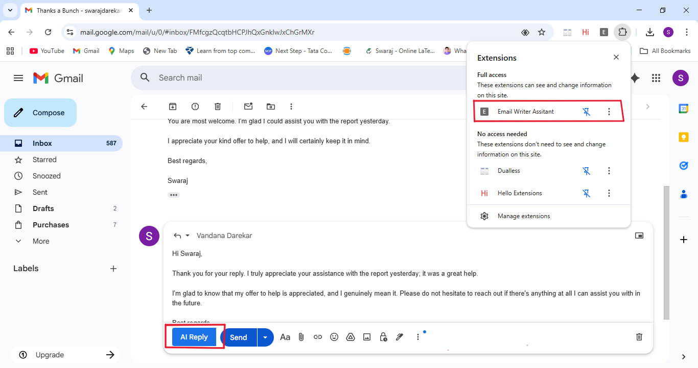
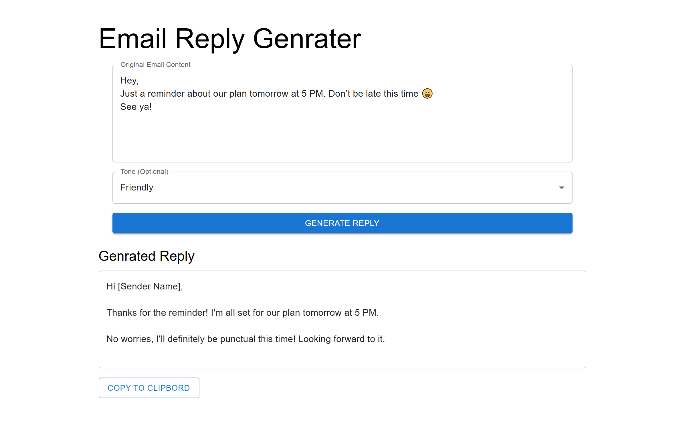

# 📧 Email-Reply-AI  
**AI-powered email reply generator using Gemini API, Chrome Extension, and React App**

Email-Reply-AI is a full-stack system that automatically generates high-quality, tone-controlled email responses.  
It includes:

✅ **Spring Boot Backend (Gemini API Integration)**  
✅ **Chrome Extension for Gmail Auto-Reply**  
✅ **React App for tone-based reply generation**  

This project helps users reply to emails faster with AI-generated responses in styles such as **formal**, **friendly**, and **professional**.

---


## 🎥 Demo Video

https://github.com/user-attachments/assets/a217d56c-eb3c-489c-b6d7-d0a2febe560d


## 🖼️ Screenshots

### 🔹 Chrome Extension in Gmail


### 🔹 React App – Tone-based Reply Generator



---

  


## 🚀 Features

### 🔮 AI-Powered Email Replies  
- Generates replies using **Gemini API**  
- Understands email context  
- Produces clear, human-like, contextual responses  

### 🎭 Tone-Based Replies  
Choose your reply tone:  
- **Formal**  
- **Friendly**  
- **Professional**  


### 🧩 Chrome Extension for Gmail  
- Works directly inside Gmail  
- Select any email → click “Generate Reply”  
- AI reply appears instantly  
- Fast and intuitive UI

### 🖥 React Web App  
- Clean dashboard to generate replies  
- Choose tone, paste email text, get results  
- Useful if not using the Chrome extension

### 🔗 REST API (Spring Boot)  
- Gemini-powered backend  
- Endpoints for reply generation  
- Proper request/response structure

---

## 🏗 Project Structure

```bash

Email-Reply-AI/
│
│── Email-Reply-Ai-Spring-Boot-API/                       # ⚙️ Backend (Spring Boot API)
│      ├── src/
│      │   └── main/java/com/email/writer/                # Main Java source folder
│      │        │
│      │        ├── app/                                  # Core application package
│      │        │    ├── EmailGeneratorController.java    # REST Controller → Handles API requests
│      │        │    │
│      │        │    ├── EmailGeneratorService.java       # Service → Calls Gemini API & processes reply
│      │        │    │ 
│      │        │    └── EmailRequest.java                # Model/DTO → Represents request body
│      │        │
│      │        └── EmailWriterSbApplication.java         # Main Spring Boot application class
│      │
│      ├── pom.xml                                        # Maven dependencies & project config
│      └── .gitignore                                     # Git ignored files
│
│
├── Email-Reply_AI-Chrome-Extension/                      # 🌐 Chrome Extension (Gmail Auto-Reply)
│      │
│      ├── content.css                                    # Styles for Gmail injected UI
│      │
│      ├── content.js                                     # Script that interacts with Gmail webpage
│      │
│      └── manifest.json                                  # Chrome extension configuration
│
│
├── Email-Reply_React-App/                                # 💻 Frontend (React.js)
│      │
│      ├── public/                                        # Public assets
│      │     └── vite.svg                                 # Default Vite logo
│      │
│      ├── src/                                           # React source files
│      │     ├── App.css                                  # Styling for App component
│      │     ├── App.jsx                                  # Main UI component
│      │     ├── index.css                                # Global CSS
│      │     └── main.jsx                                 # App entry point
│      │
│      ├── .gitignore                                     # Git ignored files
│      ├── eslint.config.js                               # ESLint configuration
│      ├── index.html                                     # HTML entry template (Vite)
│      ├── package-lock.json                              # Dependency lock file
│      ├── package.json                                   # Node dependencies & scripts
│      └── vite.config.js                                 # Vite build configuration

```

---

## ⚙️ Tech Stack

### Backend
- **Java 17**
- **Spring Boot**
- **Gemini API**
- REST APIs

### Frontend
- **React.js**
- Tailwind / CSS (if used)
- Axios API calls

### Chrome Extension
- Manifest V3
- JavaScript / HTML / CSS
- Communication with backend API

---

# 🛠 Installation & Setup Guide

---

## 🔹 1. Clone the Repository

```bash
git clone https://github.com/Swaraj-Darekar/Email-Reply-AI.git
cd Email-Reply-AI
```

🔹 **2. Backend Setup (Spring Boot + Gemini API)**

### **Install Dependencies**
```bash
cd Email-Reply-Ai-Spring-Boot-API
```

### **Configure Gemini API Key**

Add the following in your **environment variable** or inside **application.properties**:

```properties
GEMINI_API_KEY=your_key_here
```

### **Run the Server**

Start the Spring Boot application:

```bash
mvn spring-boot:run
```

Your backend server will start at:
```bash
http://localhost:8080

```

### 🔹 3. React App Setup

Navigate to the React project:

```bash
cd Email-Reply_React-App
```

Install dependencies:

```bash
npm install
```

Start the development server:
```bash
npm start
```

Your React app will run at:
```bash
http://localhost:3000
```


### 🔹 4. Chrome Extension Setup

1. Open Chrome Extensions page:

2. Enable **Developer Mode** (top-right corner).

3. Click **Load Unpacked**.

4. Select the folder:

5. The extension will appear — **Pin it** to your Chrome toolbar for quick access.


### 📡 API Endpoint (Example)

**POST** `/api/generate-reply`

#### 🔸 Request
```json
{
  "emailText": "Hi, can you send project details?",
  "tone": "professional"
}
```
🔸 Response
```json
{
  "reply": "Hello, sure! I will share the project details shortly."
}
```

### 📈 Future Enhancements

✨ Support for multiple languages  
✨ Saving history of replies  
✨ Custom templates for business emails  
✨ Analyzing sentiment of incoming emails  
✨ Multi-account support  

## 👨‍💻 Author
**Swaraj Darekar**  
📧 swarajdarekar3634@gmail.com  
💻 Passionate about Data Science & AI-based Web Apps  

---
✨ Reply faster, work smarter — powered by AI automation! ✨